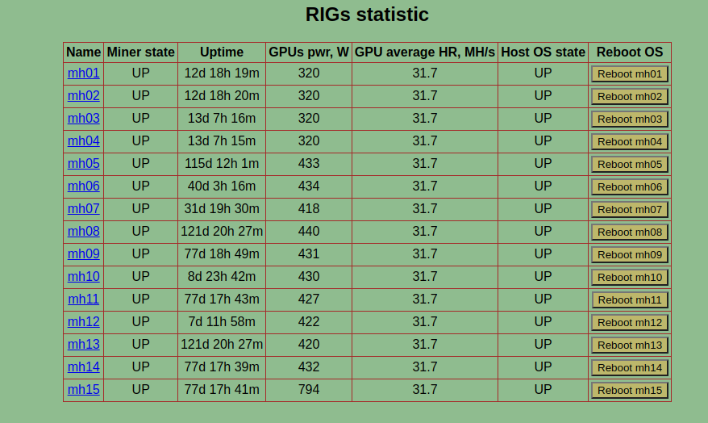

# Пример кода Python
## Задача:
- Собрать с множественных инстансов с установленным gminer статистику работы приложения, метрики представить в виде сводной таблицы.
- Предусмотреть возможность из приложения программной перезагрузки удаленного рига
- Предусмотреть по клику по кнопке с именем конкретного рига переход на сайт со статистикой конкретного рига.

### Screenshot таблицы со статистикой:
